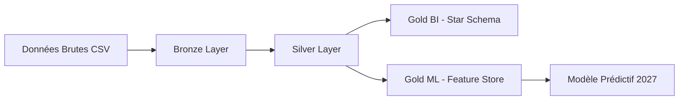

# Architecture des Données

Le projet suit l'architecture de données **Médaillon**, permettant de garantir la qualité et la traçabilité des données de la source jusqu'au modèle de Machine Learning.

## 🏗️ Les 3 Couches du Projet

### 1. 🟤 Bronze (Raw)

- **Source** : Fichiers CSV bruts issus de data.gouv.fr et du SSMSI.
- **Traitement** : Ingestion "telle quelle".
- **Format** : Apache Parquet.
- **Objectif** : Conservation de la "Vérité Brute" avec ajout de métadonnées de lignage (`source_file`, `processing_timestamp`).

### 2. 🥈 Silver (Cleaned & Enriched)

- **Traitement** : Nettoyage (Regex), normalisation des types, filtrage géographique strict sur Lyon...
- **Enrichissement** : Jointure avec le référentiel politique (Blocs idéologiques).
- **Objectif** : Fournir une table "Propre" et stable, prête pour l'analyse. C'est la couche pivot pour la qualité.

### 3. 🥇 Gold (ML-Ready / BI)

- **Produit 1 : Gold BI** : Schéma en constellation (Faits & Dimensions) pour le reporting et la visualisation.
- **Produit 2 : Gold ML** : Table plate (Feature Store) optimisée pour l'entraînement du modèle prédictif (à venir).

#### 🛡️ Intégrité Numérique (Source of Truth)

Une décision a été prise concernant la précision des calculs :

- **Recalcul Systématique** : Aucun pourcentage ou ratio n'est extrait directement des fichiers sources (pour éviter les erreurs d'arrondi).
- **Entiers Bruts** : La couche Silver ne manipulent que des **entiers bruts** (nombre de voix, inscrits, votants...).
- **Précision Gold** : Les métriques analytiques sont calculées uniquement en couche Gold au moment de la modélisation.

## 🔄 Flux de Données

---

!!! tip "Mise en œuvre pratique"
Pour exécuter l'intégralité de ce flux de manière automatisée (de l'ingestion brute à la couche Gold), consultez la section sur le **[Lancement Global de la Pipeline](guide.md#lancement-global-de-la-pipeline-bash)**.
