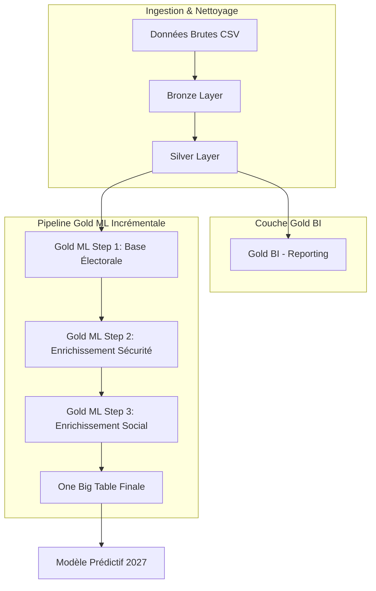

# Architecture des Données

Le projet suit l'architecture de données **Médaillon**, permettant de garantir la qualité et la traçabilité des données de la source jusqu'au modèle de Machine Learning.

## 🏗️ Les 3 Couches du Projet

### 1. 🟤 Bronze (Raw)

- **Source** : Fichiers CSV bruts issus de data.gouv.fr et du SSMSI.
- **Traitement** : Ingestion "telle quelle".
- **Format** : Apache Parquet.
- **Objectif** : Conservation de la "Vérité Brute" avec ajout de métadonnées de lignage (`source_file`, `processing_timestamp`).

### 2. 🥈 Silver (Cleaned & Enriched)

- **Traitement** : Nettoyage (Regex), normalisation des types, filtrage géographique strict sur Lyon...
- **Enrichissement** : Jointure avec le référentiel politique (Blocs idéologiques).
- **Objectif** : Fournir une table "Propre" et stable, prête pour l'analyse. C'est la couche pivot pour la qualité.

### 3. 🥇 Gold (ML-Ready / BI)

- **Produit 1 : Gold BI** : Schéma en constellation (Faits & Dimensions) pour le reporting et la visualisation.
- **Produit 2 : Gold ML (One Big Table)** : Une table unique "plate" regroupant toutes les features.

#### 🔄 Pipeline Gold ML Incrémentale

Contrairement à une approche monolithique, la construction de la table finale pour le Machine Learning est **découpée en 3 étapes séquentielles** :

1.  **Step 1 (Base)** : Création du socle électoral (Pivotement des blocs politiques).
2.  **Step 2 (Security)** : Enrichissement par les indicateurs de délinquance (3 Piliers & Deltas).
3.  **Step 3 (Social)** : Enrichissement par les données socio-économiques Insee (Revenus, Pauvreté).

#### ❓ Pourquoi une approche incrémentale ?

Nous avons opté pour ce design pour quatre raisons fondamentales :

1.  **Auditabilité (Checkpoints)** : À chaque étape, un fichier Parquet intermédiaire est généré. Cela permet à un Data Scientist d'auditer la donnée à la fin de l'étape 2 sans avoir à relancer toute la chaîne.
2.  **Debuggabilité ciblée** : Si une erreur de jointure survient sur les données Insee (Step 3), nous savons immédiatement que le problème est isolé dans ce script, sans impacter la logique électorale ou de sécurité.
3.  **Modularité (Plugin-like)** : Si demain nous souhaitons ajouter un "Step 4 : Météo" ou "Step 5 : Transports", il suffit de créer un nouveau script qui consomme la sortie du Step 3, sans toucher au code existant.
4.  **Optimisation des Ressources** : Spark gère mieux des transformations séquentielles sauvegardées sur disque que des jointures massives à 15 tables en une seule exécution, évitant ainsi les débordements de mémoire (OOM).

---

## 🔄 Flux de Données

---

!!! tip "Mise en œuvre pratique"
    Pour exécuter l'intégralité de ce flux de manière automatisée (de l'ingestion brute à la couche Gold), consultez la section sur le **[Lancement Global de la Pipeline](onboarding.md#lancement-global-de-la-pipeline)**.
