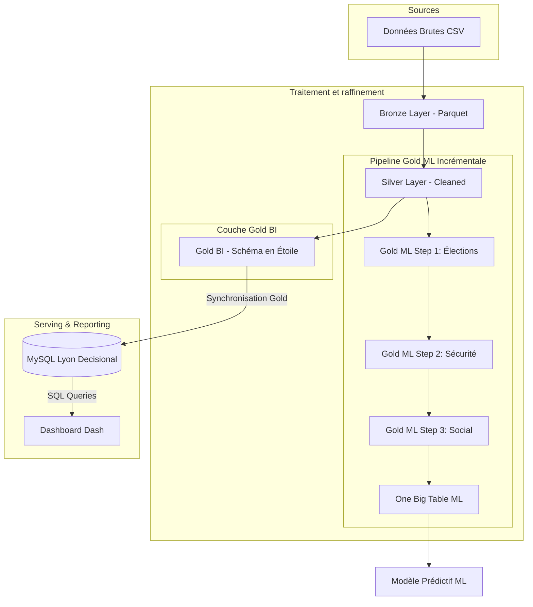
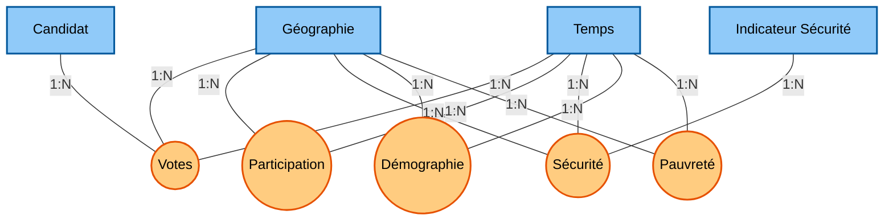
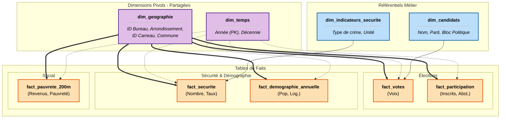
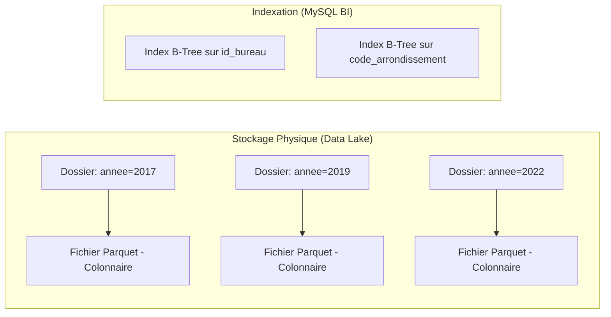

# Architecture des Données

Le projet suit l'architecture de données **Médaillon**, permettant de garantir la qualité et la traçabilité des données de la source jusqu'au modèle de Machine Learning.

## 🏗️ Les 3 Couches du Projet

### 1. 🟤 Bronze (Raw)
- **Source** : Fichiers CSV bruts issus de data.gouv.fr et du SSMSI.
- **Traitement** : Ingestion "telle quelle".
- **Format** : Apache Parquet.

### 2. 🥈 Silver (Cleaned & Enriched)
- **Traitement** : Nettoyage (_Regex_), normalisation des types, filtrage géographique sur Lyon.
- **Enrichissement** : Jointure avec le référentiel politique (_Blocs idéologiques_).

### 3. 🥇 Gold (ML-Ready / BI)
- **Produit 1 : Gold BI** : Schéma en constellation d'étoiles pour le reporting.
- **Produit 2 : Gold ML (One Big Table)** : Table plate regroupant toutes les features.

---

## 🔄 Flux de Données

---

## 📐 Modélisation du Système Décisionnel (OLAP)

Le passage d'une donnée brute à une information exploitable suit trois niveaux de modélisation.

### 1️⃣ Modèle Conceptuel (MCD) : Vision Métier
Le MCD identifie les **Processus Métiers** (bulles) et les **Axes d'analyse** (rectangles).

**Cardinalités :** En OLAP, les relations sont de type **1:N**. Une dimension (ex: une année) est liée à plusieurs faits (ex: des milliers de votes).

### 2️⃣ Modèle Logique (MLD) : Schéma en Constellation
Le MLD définit la structure des tables. On utilise la **dénormalisation** pour maximiser la vitesse de lecture.

### 3️⃣ Modèle Physique (MPD) : Optimisation du Stockage
Le MPD gère la performance via le stockage colonnaire et le partitionnement.

| Composant | Technologie | Justification BI |
| :--- | :--- | :--- |
| **Format** | **Apache Parquet** | Compression élevée et lecture ultra-rapide des colonnes de mesures. |
| **Partition** | **Année** | Évite le "Full Table Scan" lors des analyses temporelles. |
| **Index** | **Clés Substituts** | Jointures entières (INT) beaucoup plus rapides que sur des chaînes. |

---

### 🔍 Détails des Relations et Granularité

Le schéma repose sur l'utilisation de **clés de jointure naturelles et de substitution (SK)** :

1.  **Axe Géographique :** Lié par `id_bureau` (Élections), `code_arrondissement` (Sécurité) et `sk_geographie` (Social).
2.  **Axe Temporel :** Toutes les tables sont liées à `dim_temps` via l'année, permettant le croisement entre délinquance et résultats électoraux sur une même période.
3.  **Axe Candidats :** Permet d'analyser les votes par **Bloc Analytique** (Gauche, Droite, Centre, etc.).

---

!!! tip "Mise en œuvre pratique"
Pour exécuter l'intégralité de ce flux de manière automatisée, consultez le **[Guide de démarrage](onboarding.md)**.
